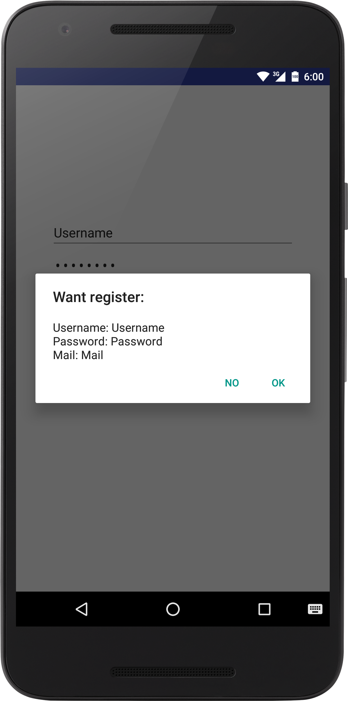
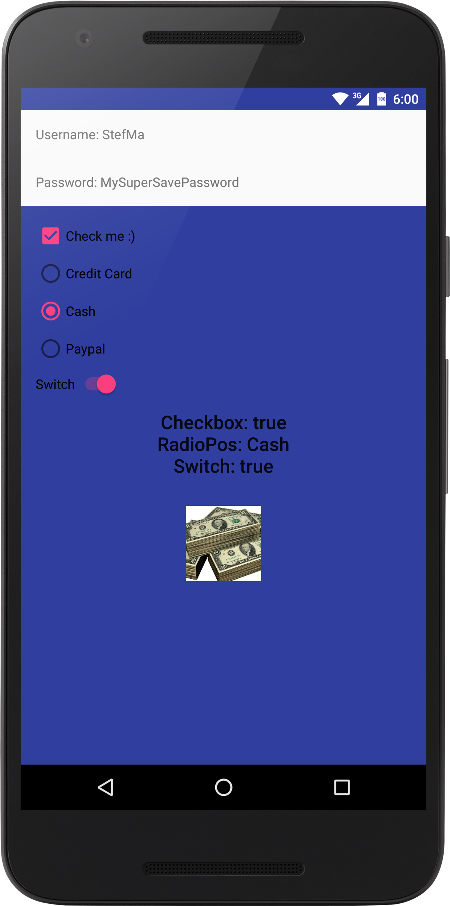

# A simple DataBinding example
## What is DataBinding?
DataBinding for Android is a library to write declarative layouts and minimize the glue code necessary to bind your application logic and layouts.
The library used the MVVM (Model-View-ViewModel) pattern for this.  
## Get the sample
Simply clone this repo and open the `build.gradle` in the root directory with Android Studio.
## Screenshots

# Links that helped me a lot
* [Android DataBinding Guide](https://developer.android.com/tools/data-binding/guide.html)
* [Droidcon New York 15](https://www.youtube.com/watch?v=WdUbXWztKNY)
* [Stablekernel](http://blog.stablekernel.com/mvvm-on-android-using-the-data-binding-library/)
* [Android Authority](http://www.androidauthority.com/android-m-data-binding-615674/)
